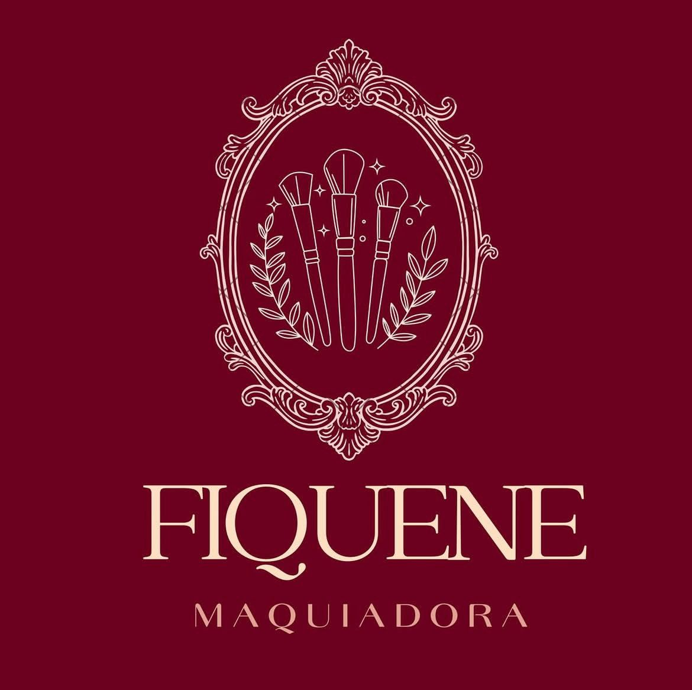
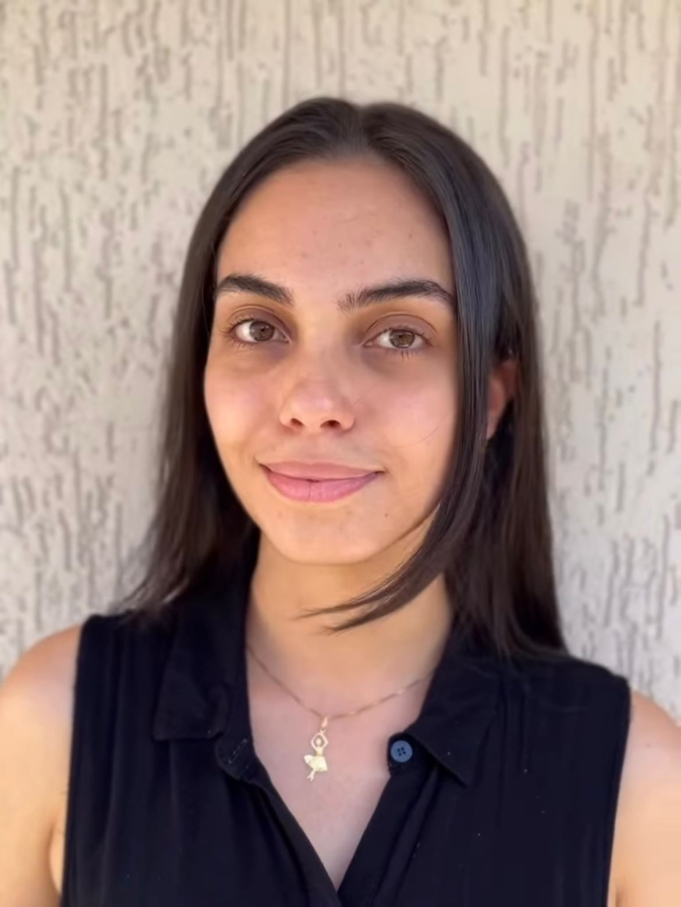
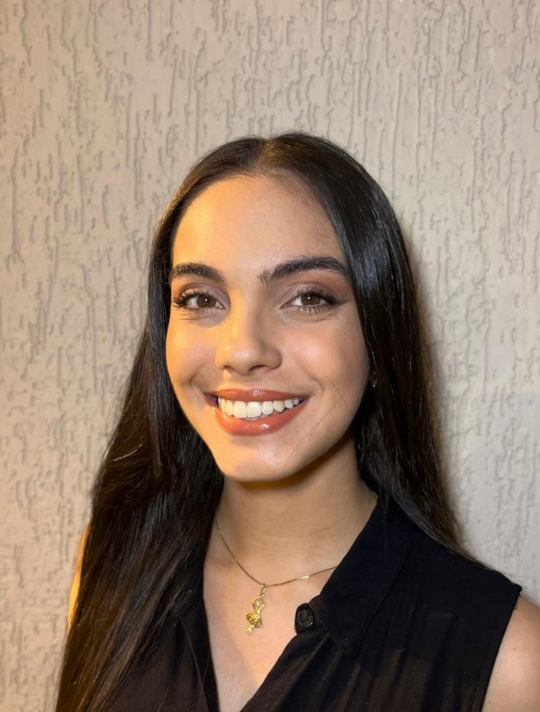
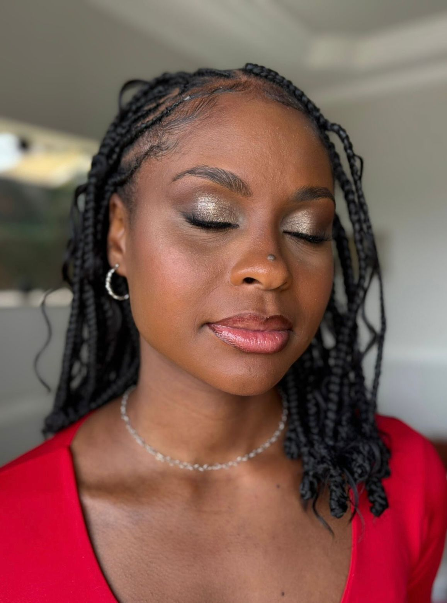
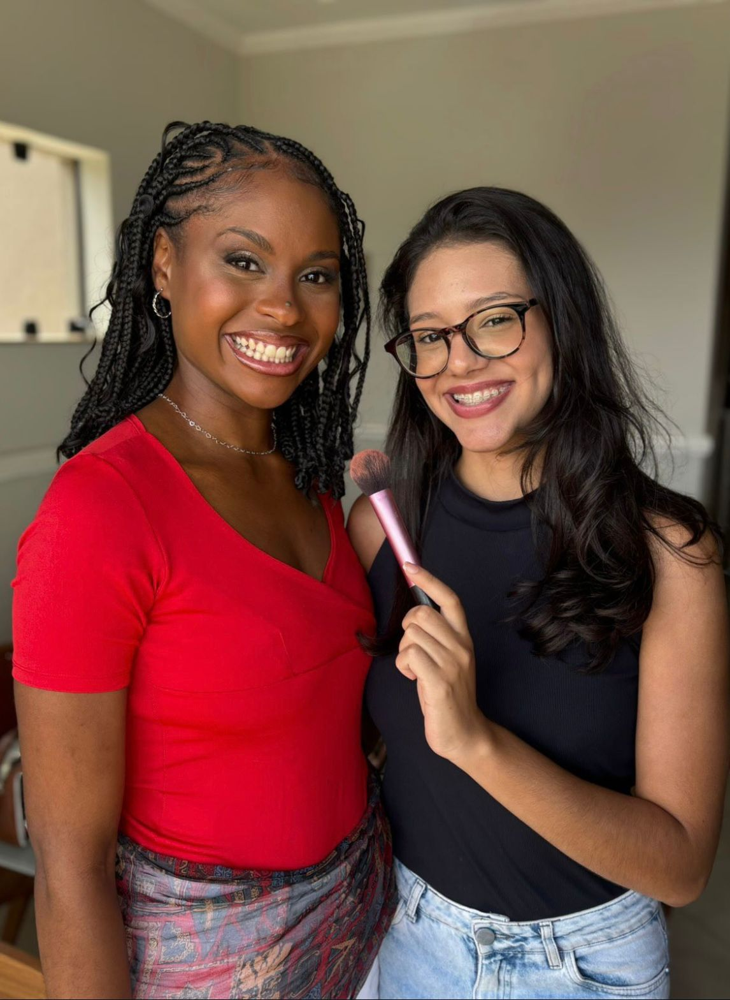

<!DOCTYPE html>
<html lang="pt-br">
<head>
  <meta charset="UTF-8">
  <meta name="viewport" content="width=device-width, initial-scale=1.0">
  <title>Giovanna Fiquene Ribeiro</title>

  <link href="https://fonts.googleapis.com/css2?family=Playfair+Display:wght@500;700&family=Cormorant+Garamond:wght@400;600&family=Montserrat:wght@300;400&display=swap" rel="stylesheet">
  <link rel="stylesheet" href="style.css">
</head>

<body>

<nav class="menu">
  <a href="#sobre">Sobre</a>
  <a href="#servicos">Serviços</a>
  <a href="#galeria">Resultados</a>
  <a href="#contato">Contato</a>
</nav>

<header class="hero">
  
  

  

    <h1>Giovanna Fiquene Ribeiro</h1>
    
Maquiadora Profissional

  

</header>

<section class="sobre" id="sobre">
  

    

    

      <h2>Sobre a maquiadora</h2>
      

        Giovanna Fiquene Ribeiro é uma maquiadora profissional, formada em automaquiagem, maquiagem social e para eventos por Hilary Fraga, dedicada a valorizar
        a beleza natural com elegância, leveza e sofisticação em cada detalhe, atuando em Mogi das Cruzes e região.
      

    

  

</section>

<section class="servicos" id="servicos">
  <h2>Serviços</h2>

  

    

      <h3>Maquiagem Básica</h3>
      R$ 80,00
    

    

      <h3>Maquiagem Elaborada (Madrinha / Formanda)</h3>
      R$ 150,00
    

    

      <h3>Curso de Automaquiagem</h3>
      R$ 80,00
    

  

</section>

<section class="galeria" id="galeria">
  <h2>Antes & Depois</h2>

  

    
    
    
    
  

</section>

<section class="motivacao">
  

    

      
    

    

      <h2>Realce sua beleza</h2>
      

        A maquiagem é mais do que um detalhe, é 
        atitude, é presença, é aquele toque de poder
        que muda tudo, que fala antes mesmo de você 
        dizer uma palavra.

        Só você, sua essência e toda a sua intensidade
        sendo realçadas. Porque quando você se sente
        linda, o mundo percebe!
      

    

  

</section>

<section class="contato" id="contato">
  <h2>Contato</h2>

  

    
gi.fiquene27@gmail.com

    <a href="https://wa.me/5511996212459">WhatsApp</a>
  

  

    <a href="https://instagram.com/fiquenemaquiadora">@fiquenemaquiadora</a>
  

</section>

<section class="frase">
  

  

    <h2>"A beleza começa no momento em que você decide ser você mesma."</h2>
  

</section>

<footer>
  
© 2026 Giovanna Fiquene Ribeiro

</footer>

</body>
</html>
